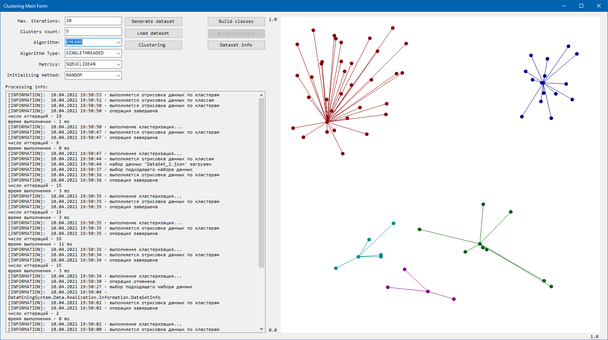
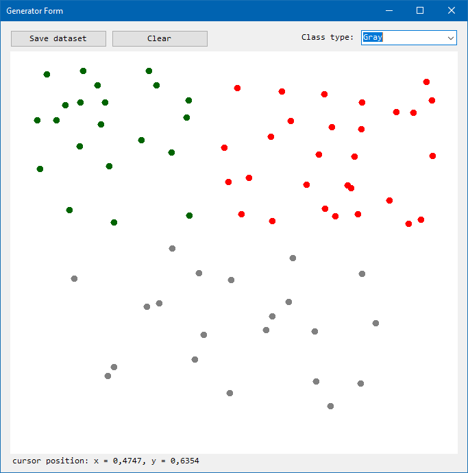

# 
 Data clustering system

Кластеризатор набора данных.

## Перечень технологий

net8.0

## Описание

- методы кластеризации `KMEANS`, `KMEDOIDS`;
- формат ввода / вывода данных `*.json` и `*.xml`;
- UI реализация `Windows Forms` и `WPF`.

## Пример UI компонентов

